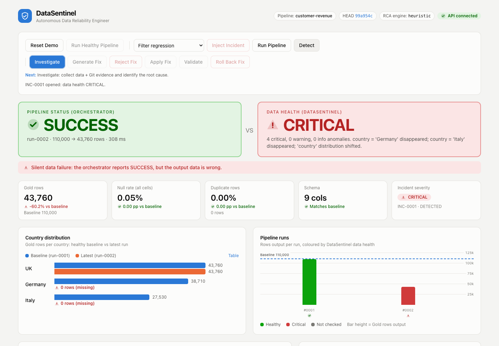
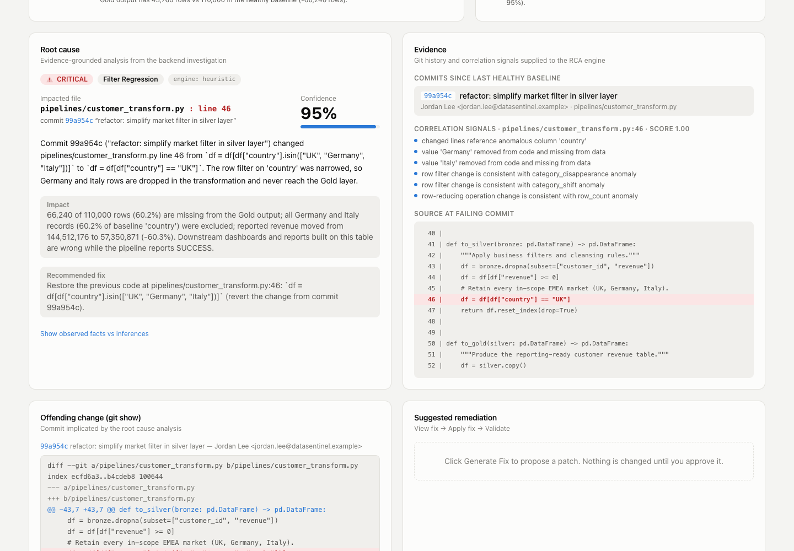
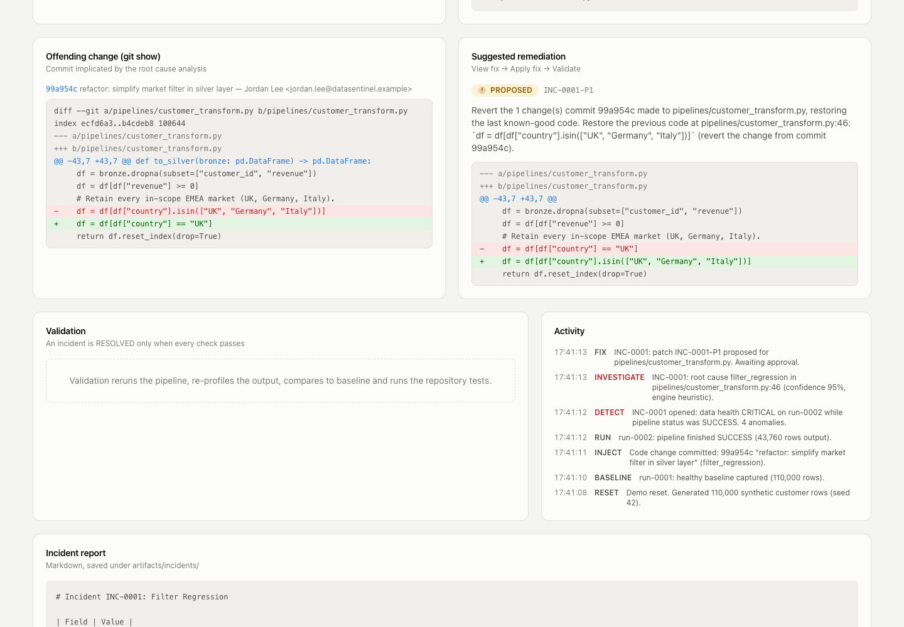
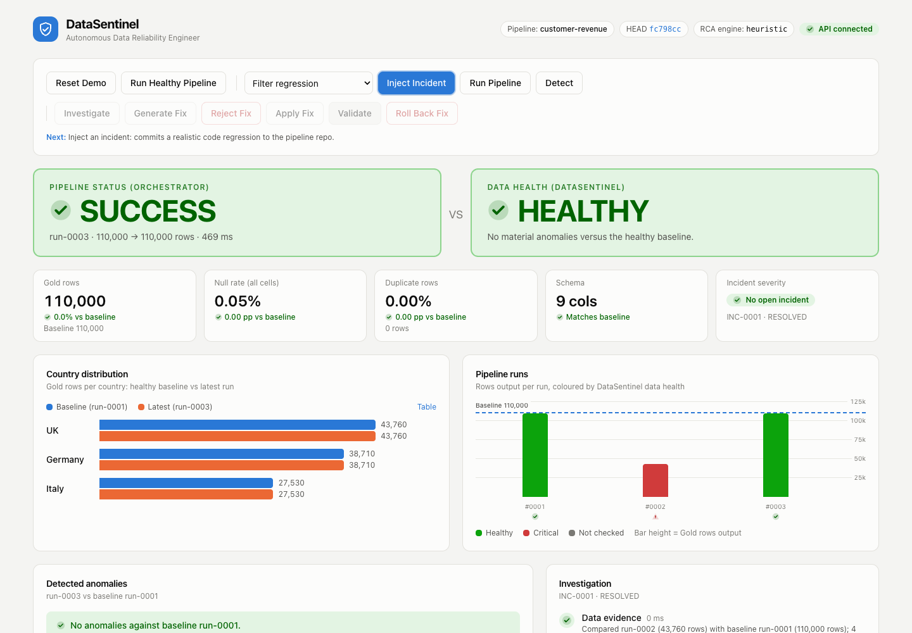
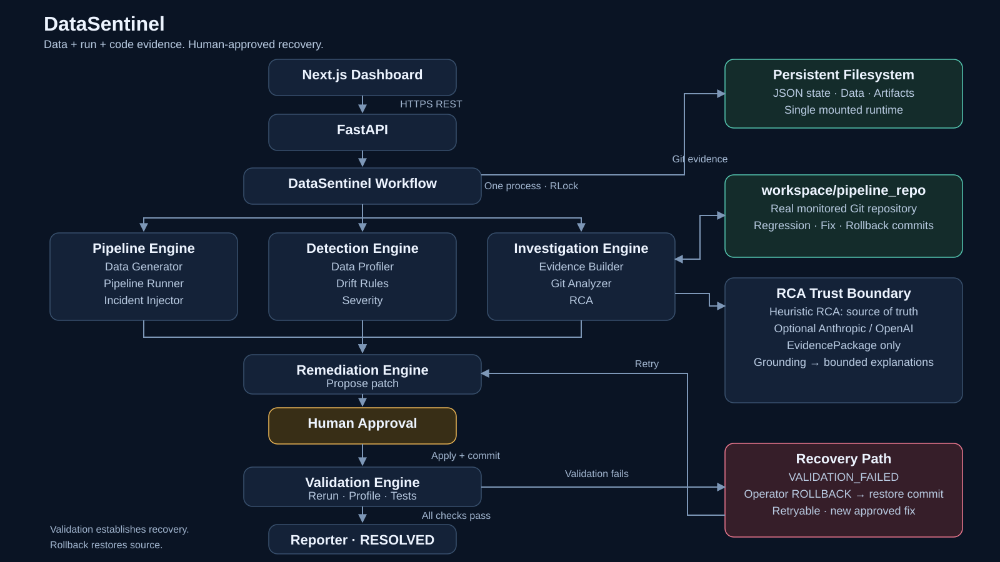

# DataSentinel

**Your pipeline can succeed while your data fails.**

[Open the live demo](https://datasentinel-seven.vercel.app)

An Autonomous Data Reliability Engineer that connects data, run and code evidence to investigate silent failures and validate an approved repair.

> **Pipeline Status: SUCCESS**<br>
> **Data Health: CRITICAL**

## The Problem

Orchestrators tell us whether jobs ran, not whether the output is correct. Narrowed filters, schema drift, null explosions, duplicate ingestion, distribution shifts and broken transformations can all leave a green pipeline producing bad data.

## The Solution

**DETECT → INVESTIGATE → ROOT CAUSE → PROPOSE → APPLY → VALIDATE → REPORT**

DataSentinel compares output with a healthy baseline, correlates anomalies with real Git changes and proposes a repair. An operator approves the patch. Reruns, profile comparisons and repository tests must pass before the incident is resolved. Failed committed remediation supports operator-controlled rollback and retry.

This MVP uses reproducible synthetic customer data. The public demo uses heuristic RCA and needs no external AI key.

## Live Demo

**[Launch DataSentinel](https://datasentinel-seven.vercel.app)**

Click **Reset Demo → Run Healthy Pipeline**, select **Filter regression**, then **Inject Incident → Run Pipeline → Detect → Investigate → Generate Fix → Apply Fix → Validate**.

[Click-by-click guide](docs/demo.md) · [4:30 video script](docs/demo-video-script.md) · [30-second storyboard](docs/micro-demo.md)

## Demo Scenario

| Healthy output | Regressed output | Row change | Missing markets |
|---|---|---|---|
| 110,000 rows | 43,760 rows | −60.2% | Germany and Italy |

A real commit narrows `country.isin(["UK", "Germany", "Italy"])` to `country == "UK"`. Execution still reports SUCCESS. Detection marks data CRITICAL, and RCA identifies `pipelines/customer_transform.py:46` and the offending commit. The approved reverse patch restores all three countries and validates to RESOLVED.

## Screenshots

Captured from the live application at a consistent 1440 × 1000 viewport. [Capture provenance](docs/screenshots/capture.json) · [Repeatable capture instructions](docs/screenshot-checklist.md).

**Silent failure**



**Evidence-grounded root cause**



**Proposed repair, awaiting operator approval**



**Validated recovery**



[Healthy baseline](docs/screenshots/healthy.png) · [Real Git diff](docs/screenshots/git-evidence.png) · [Passed validation checks](docs/screenshots/validation-passed.png)

The correct hosted repair passes validation. Live failed-validation and rollback captures are therefore not claimed; the [capture guide](docs/screenshot-checklist.md) describes the recovery capture limitation.

## Architecture



The dashboard calls FastAPI over REST. A single workflow coordinates simulation, profiling, detection, investigation, remediation, validation and reporting. JSON state, artifacts and the generated monitored repository persist on disk.

[Architecture details](docs/architecture.md) · [Mermaid source](docs/architecture.mmd)

## How It Works

**DATA STATE + RUN STATE + CODE STATE → evidence-grounded RCA**

Profiles establish what changed. Run history establishes when it changed and whether execution succeeded. Git history supplies the transformation changes to investigate. Deterministic rules calculate metrics and severity; heuristic RCA correlates those observations with code evidence. Optional model explanations are constrained to the evidence package and grounded before use.

## Why Real Git Evidence Matters

`workspace/pipeline_repo` is a separate, generated **real Git repository**. Injected regressions, approved fixes and rollbacks create actual commits. RCA cites its history and diffs while DataSentinel’s own application history stays clean. Reset recreates the monitored repository from its checked-in template; never edit the generated workspace manually.

## Safety Design

- Deterministic detection and heuristic-first RCA; optional LLM output grounded to evidence.
- Patch preview and explicit **Apply Fix** approval before modification.
- Python-only patch targets confined to the monitored repository, with hash checks and backups.
- Validation must pass before RESOLVED; a failed committed fix remains open.
- Operator-controlled rollback restores pre-fix source, commits the restoration and permits retry. Rollback itself does not prove healthy data.
- Exactly one backend process and instance: JSON/filesystem state uses process-local locking.
- Provider secrets belong only in backend environment settings.

The public app is a shared, resettable synthetic-data demo. Production authentication and tenant isolation are roadmap work.

## Incident Types

| Type | Regression | Detected signal |
|---|---|---|
| Filter regression | Three-country filter becomes UK only | Row loss, missing countries, distribution shift |
| Null explosion | Enterprise sales representatives masked | Null-rate drift |
| Duplicate ingestion | Replay batch appended again | Duplicates and row growth |
| Schema drift | Revenue column renamed | Missing/unexpected columns |
| Revenue distribution shift | Revenue divided by 100 | Numeric distribution shift |

## IBM Bob Contribution

IBM Bob improved an existing working repository; it did **not** build the entire product. Bob initialized and understood the repository, independently assessed reliability and identified a missing recovery path after committed remediation failed validation.

Bob implemented operator-controlled rollback and its frontend flow, hardened RCA trust boundaries, improved state/report persistence ordering and duplicate-apply idempotency, added single-worker deployment warnings, and expanded regression/adversarial tests. It then independently reviewed the implementation. The supplied Bob critic assessment reported **no HIGH/CRITICAL blockers** and **RELEASE READY: YES**.

[Repository assessment](improvements-plan.md); implementation commit `8176e22`.

## Development Workflow

| Tool | Contribution |
|---|---|
| Claude Code | Initial working MVP |
| Codex | Testing, QA, hardening, deployment preparation and release content |
| IBM Bob | Repository-level reliability engineering and independent critic review |

## Testing

Verified engineering release: **62/62 backend tests passed**, **TypeScript clean**, **production frontend build passed**. The hosted golden path and restart persistence were verified. [Validation record](docs/release-validation.md).

```sh
(cd backend && python -m pytest -v)
python scripts/run_golden_path.py
(cd frontend && npm run lint && npm run build)
```

Tests use temporary directories and fake providers. `npm run lint` runs TypeScript checking (`tsc --noEmit`).

## Deployment

Public frontend: **https://datasentinel-seven.vercel.app**. [Technical deployment settings and checks](docs/deployment.md).

## Local Setup

Prerequisites: Python 3.11+, Node 20.9+ and Git on PATH.

```sh
# Backend, terminal 1
cd backend
python -m venv .venv
source .venv/bin/activate
pip install -r requirements.txt
LLM_PROVIDER=heuristic uvicorn app.main:app --host 127.0.0.1 --port 8000 --workers 1
```

```sh
# Frontend, terminal 2
cd frontend
npm ci
cp .env.local.example .env.local
npm run dev
```

Open http://localhost:3000, then Reset Demo and Run Healthy Pipeline. Run root demo scripts from the repository root, with the backend environment activated. Stop an API process before running scripts against the same runtime directory.

Root `.env.example` documents backend settings. `DATASENTINEL_HOME` defaults to the repository root and `DATASENTINEL_WORKSPACE_DIR` to `<home>/workspace`. CORS uses `DATASENTINEL_CORS_ORIGINS` as a JSON array. Heuristic RCA is the default; optional provider keys belong in an ignored `.env` or backend environment settings, never frontend variables.

## Future Roadmap

Databricks, Airflow, dbt, Snowflake and Azure Data Factory integrations; GitHub correlation, Slack notifications and historical incident memory. Enterprise work includes authentication, isolation and storage/locking suitable for multiple processes. No delivery timelines are claimed.

[Submission copy](docs/submission.md) · [Seven-slide deck content](docs/pitch-deck.md)
