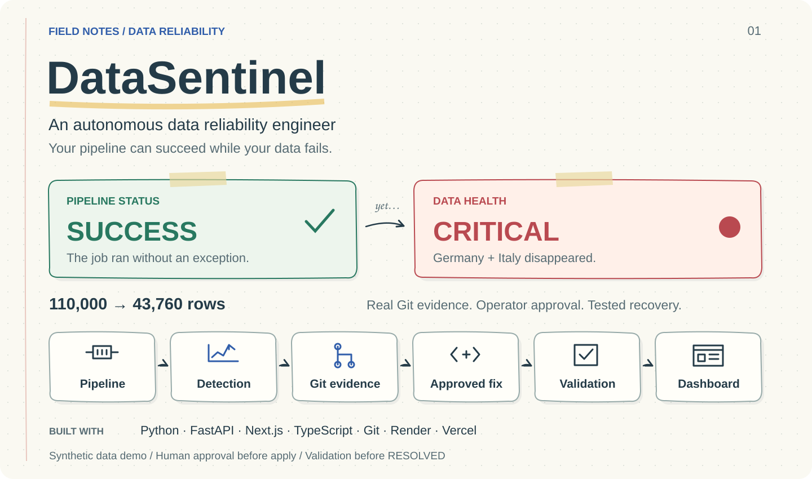
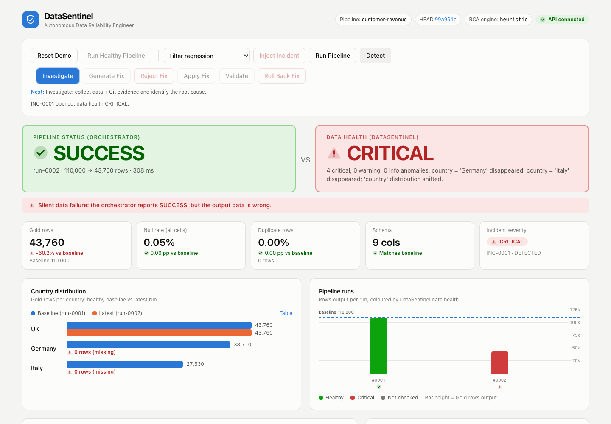
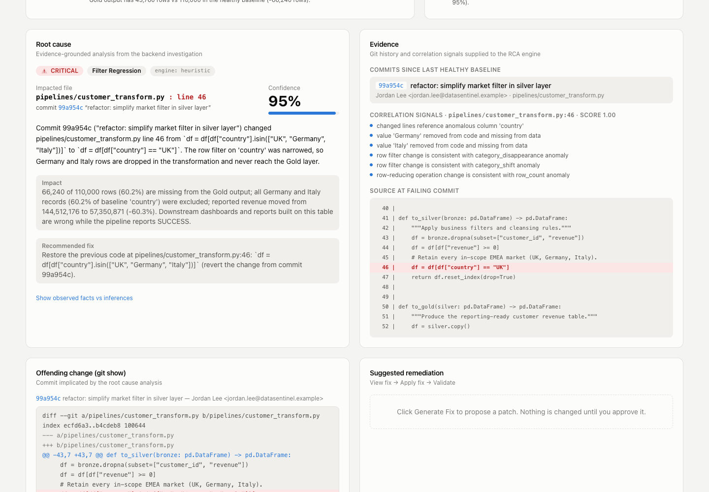
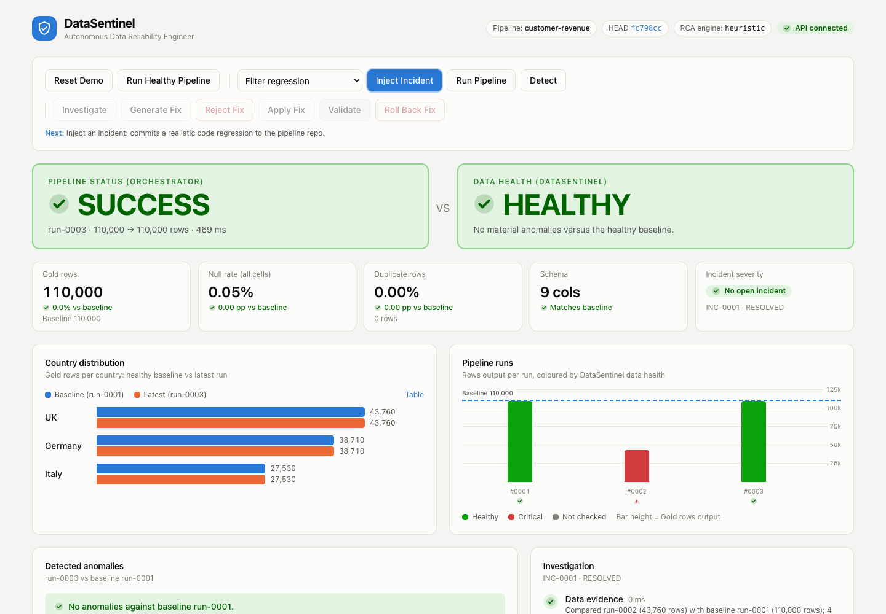
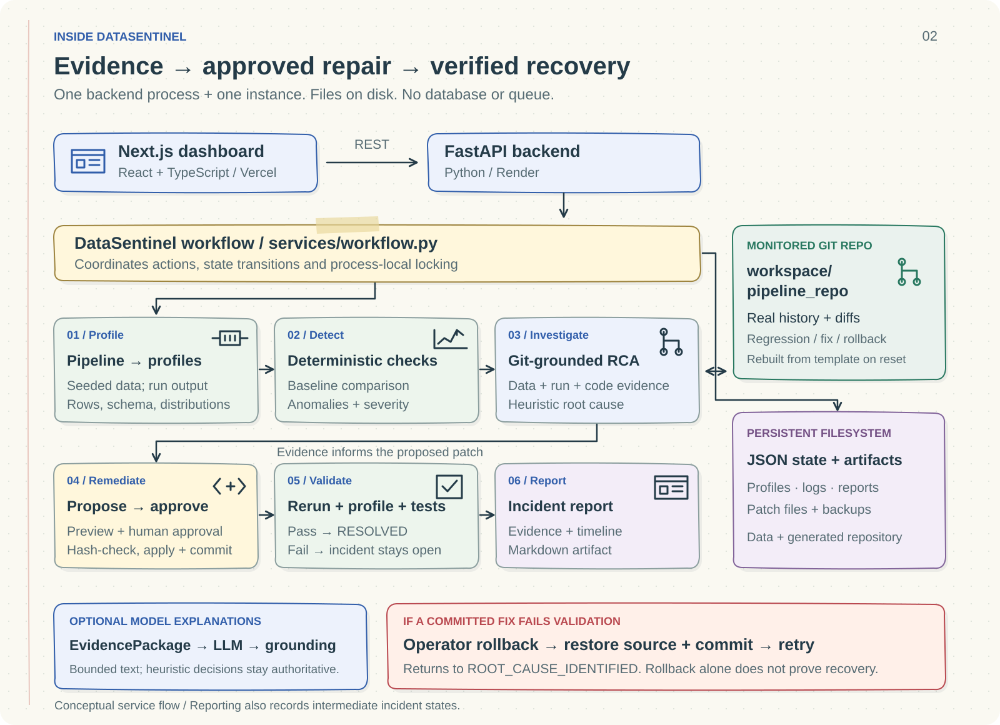

# DataSentinel

**Your pipeline can succeed while your data fails.**

[Live Demo](https://datasentinel-seven.vercel.app) · [GitHub Release](https://github.com/nitesh0007-edith/DataSentinel/releases/tag/v1.0-hackathon) · [IBM Bob Evidence](docs/ibm-bob/README.md)



DataSentinel investigates silent data failures: it checks output against a healthy baseline, connects anomalies to real Git changes, proposes a repair and validates recovery after an operator approves it.

**Hackathon MVP** · Synthetic customer data · Heuristic RCA in the public demo · [Recorded validation: 62/62 backend tests](docs/release-validation.md)

## The problem: a green job can produce bad data

A narrowed filter can remove entire markets without raising an exception. The pipeline reports **SUCCESS**, while downstream analytics receive incomplete data. Execution logs alone cannot explain what changed or how to recover.

DataSentinel brings **data profiles + run history + code evidence** into one incident workflow:

**DETECT → INVESTIGATE → ROOT CAUSE → PROPOSE FIX → APPLY → VALIDATE → REPORT**

| Step | What makes it useful |
|---|---|
| Detect | Deterministic checks calculate row loss, schema changes, nulls, duplicates and distribution drift. |
| Investigate | Real Git history and diffs connect the anomaly to a likely file, line and commit. |
| Propose and apply | The operator previews and approves a reverse patch. Python-only targets are confined to the monitored repo and hash-checked before commit. |
| Validate | Rerun, profile comparisons and repository tests must pass before **RESOLVED**. |
| Recover safely | A failed committed fix stays open. Operator rollback restores pre-fix source, preserves evidence and allows retry. |

Optional LLM explanations are bounded and grounded to an `EvidencePackage`; metrics and heuristic decisions remain authoritative. The hosted demo needs no external model key.

## Try the golden path

**[Open the live demo](https://datasentinel-seven.vercel.app)** and follow the highlighted next action:

1. **Reset Demo → Run Healthy Pipeline** to capture a baseline.
2. Select **Filter regression**, then **Inject Incident → Run Pipeline → Detect**.
3. **Investigate → Generate Fix** to inspect the Git evidence and proposed repair.
4. **Apply Fix → Validate** to approve the change and verify recovery.

| Healthy baseline | Regressed output | Missing markets | Execution / data health |
|---|---|---|---|
| 110,000 rows | 43,760 rows (−60.2%) | Germany and Italy | SUCCESS / CRITICAL |

The injected commit changes `country.isin(["UK", "Germany", "Italy"])` to `country == "UK"`. Investigation points to `pipelines/customer_transform.py:46` and the actual session commit. The approved reverse patch restores all three countries and validates to **RESOLVED**.

[Click-by-click guide](docs/demo.md) · [Video script](docs/demo-video-script.md) · [Short storyboard](docs/micro-demo.md)

## See the evidence

**The silent failure:** the job succeeds, but two countries disappear.



<details>
<summary><strong>Inspect the root cause and validated recovery</strong></summary>

**Root cause:** the source file, line and explanation are tied to real Git evidence.



**Recovery:** the approved repair restores the baseline and passes validation.



</details>

[Git diff](docs/screenshots/git-evidence.png) · [Patch preview](docs/screenshots/proposed-fix.png) · [Validation checks](docs/screenshots/validation-passed.png) · [Healthy baseline](docs/screenshots/healthy.png)

These are real hosted captures at 1440 × 1000. [Provenance](docs/screenshots/capture.json) and [capture instructions](docs/screenshot-checklist.md) distinguish hosted evidence from the disclosed local rollback fixture. The normal hosted repair passes; no live failed-validation capture is claimed.

## Architecture



The Next.js dashboard calls FastAPI over REST. One workflow coordinates pipeline execution, profiling, detection, investigation, remediation, validation and reporting. JSON state, data, patches and reports persist on disk.

`workspace/pipeline_repo` is a separate, generated **real Git repository**. Regressions, approved fixes and rollbacks create actual commits there. Reset rebuilds it from the checked-in template; do not edit the generated workspace by hand.

A failed committed fix can return through operator rollback to `ROOT_CAUSE_IDENTIFIED`. Rollback alone does not prove data recovery: a new approved repair must pass validation.

[Module map and thresholds](docs/architecture.md) · [Detailed Mermaid diagram](docs/architecture.mmd)

## Tech stack

| Layer | Technologies |
|---|---|
| Dashboard | Next.js 16, React 19, TypeScript, Tailwind CSS 4 |
| API and data checks | Python, FastAPI, Pydantic, pandas, NumPy |
| Evidence and state | Git history/diffs, JSON state, filesystem artifacts |
| RCA | Deterministic heuristic; optional grounded Anthropic / OpenAI providers |
| Verification | pytest, TypeScript checking, Next.js production build, Playwright capture tooling |
| Hosting | Vercel frontend, Render backend with persistent disk |

Five reproducible incidents are included: filter regression, null explosion, duplicate ingestion, schema drift and revenue distribution shift.

## IBM Bob contribution

IBM Bob worked on an **existing working MVP**. It inspected the repository, identified the missing recovery path after committed remediation failed validation, and implemented operator-controlled rollback with frontend controls.

Bob also bounded RCA inference and commit/diff text, improved state/report persistence ordering, added duplicate-apply protection and single-worker warnings, expanded regression/adversarial tests, and independently reviewed the diff. Review follow-up removed an unused incident state and corrected the frontend rollback hint.

[Eight task-session screenshots](docs/ibm-bob/README.md) · [Repository assessment](improvements-plan.md) · [Implementation commit `8176e22`](https://github.com/nitesh0007-edith/DataSentinel/commit/8176e22aac7675f28ea45d51d00927307a271e45)

| Tool | Role in this repository |
|---|---|
| Claude Code | Initial working MVP |
| IBM Bob | Repository reliability engineering, hardening, validation and independent review |
| Codex | QA, hardening, deployment preparation and repository presentation |

## Run locally

Prerequisites: Python 3.11+, Node 20.9+ and Git on PATH.

```sh
# Terminal 1: backend
cd backend
python -m venv .venv
source .venv/bin/activate
pip install -r requirements.txt
LLM_PROVIDER=heuristic uvicorn app.main:app --host 127.0.0.1 --port 8000 --workers 1
```

```sh
# Terminal 2: frontend
cd frontend
npm ci
cp .env.local.example .env.local
npm run dev
```

Open http://localhost:3000, then **Reset Demo → Run Healthy Pipeline**. Backend settings are documented in [.env.example](.env.example); optional provider keys belong only in the backend environment. `DATASENTINEL_HOME` defaults to the repository root, with runtime files under `data/`, `artifacts/` and `workspace/`.

## Testing and validation

The [26 September validation record](docs/release-validation.md) documents **62/62 backend tests passing**, clean frontend TypeScript checking, a successful production build, and hosted end-to-end recovery and restart persistence. These are recorded results for the validated release, not a claim that every later documentation commit reruns the suite.

```sh
(cd backend && python -m pytest -v)
python scripts/run_golden_path.py
(cd frontend && npm run lint && npm run build)
```

Activate the backend environment and run demo scripts from the repository root. Stop any API process using the same runtime directory before running those scripts. Tests use temporary directories and fake providers; `npm run lint` is `tsc --noEmit`.

## Deployment and scope

**[Public demo on Vercel](https://datasentinel-seven.vercel.app)** · FastAPI on Render with a persistent disk. [Deployment settings and checks](docs/deployment.md).

Use exactly **one backend worker and one service instance**: locking is process-local. The public app is a shared, resettable synthetic-data demo. Authentication, tenant isolation, coordinated storage and production connectors are future work.

## Repository guide

```text
backend/app/          Workflow, reliability services and API
backend/tests/        Regression, persistence and adversarial tests
frontend/             Dashboard, panels and API client
scripts/              Demo commands and screenshot capture tools
docs/assets/          Editable notebook-style SVG illustrations
docs/screenshots/     Hosted captures and isolated local fixture evidence
docs/ibm-bob/         Selected IBM Bob task-session evidence
workspace/            Generated monitored Git repo (ignored)
artifacts/            Runtime state, profiles, patches and reports (ignored)
```

[Submission narrative](docs/submission.md) · [Pitch-deck content](docs/pitch-deck.md) · [Screenshot tooling](docs/screenshot-checklist.md)

Planned integrations include Databricks, Airflow, dbt, Snowflake and Azure Data Factory, alongside GitHub correlation, Slack notifications and incident history. These connectors are not shipped in this MVP.
