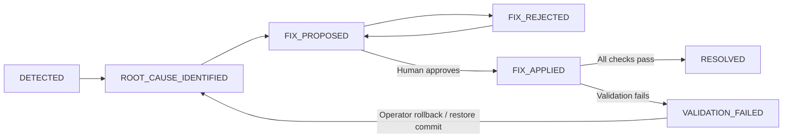

# Architecture

## Principles

1. **Deterministic before LLM.** Profiling, anomaly math, severity, evidence correlation, patch construction and validation are all plain code. The LLM (optional) only reasons and explains.
2. **Evidence-grounded RCA.** The RCA engine sees a structured `EvidencePackage` and nothing else. LLM output is validated against it.
3. **Safe remediation.** A patch is proposed, then approved, then applied (hash-checked, repo-confined and committed), then validated.
4. **Reproducible demo.** Seeded data, a template pipeline repo rebuilt on reset, and sequential IDs (`run-0001`, `INC-0001`).
5. **Simple infrastructure.** One FastAPI process, JSON state, and files on disk.

## Module map (`backend/app`)

| Module | Responsibility |
|---|---|
| `core/config.py` | `Settings` (env-driven), all `DetectionThresholds`, derived paths |
| `core/models.py` | Pydantic domain models (runs, profiles, anomalies, evidence, RCA, patch, validation, incident, state) |
| `core/state.py` | JSON state store with atomic writes |
| `pipeline/generator.py` | Deterministic synthetic customer data (numpy seed) |
| `pipeline/workspace.py` | Builds the monitored git repo from `template_repo/`; `resolve_in_repo` path confinement |
| `pipeline/runner.py` | RAW → BRONZE → SILVER → GOLD. Loads transformations fresh from the workspace. SUCCESS means "no exception", just like a real orchestrator |
| `pipeline/incident_injector.py` | Five scenarios, each a real commit by a fictional developer |
| `profiling/profiler.py` | Dataset, column, numeric and categorical statistics, saved as JSON under `artifacts/profiles/` |
| `detection/rules.py` | row_count, schema, null_rate, duplicates, category_disappearance, category_shift (TVD), numeric_drift |
| `detection/anomaly_engine.py` | Runs the rules. Overall severity is the max anomaly severity, mapped to data health |
| `investigation/git_analyzer.py` | Allowlisted, shell-free git wrapper and unified-diff parser |
| `investigation/evidence_builder.py` | Commits since the baseline commit, hunk relevance scoring, source snippets |
| `investigation/rca_agent.py` | Heuristic RCA, LLM RCA and the grounding step |
| `investigation/prompts.py` | System prompt with evidence-only rules and JSON contract; compact evidence serialisation |
| `llm/` | `LLMProvider` interface, Anthropic and OpenAI HTTP providers, env factory |
| `remediation/patch_generator.py` | Reverses the suspect commit's hunks in the implicated file, producing a diff |
| `remediation/patch_service.py` | Guarded apply, operator rollback and commits |
| `validation/validator.py` | Rerun-based checks and the pipeline repo's pytest suite |
| `reporting/incident_report.py` | Markdown report |
| `services/workflow.py` | State machine / orchestration used by the API, scripts and tests |
| `api/routes.py` | Thin HTTP layer |

## Incident lifecycle



Validation failure keeps the incident open and the applied patch available for an explicit operator rollback. Rollback restores the pre-fix source, records a new commit, preserves failure evidence and returns the incident to `ROOT_CAUSE_IDENTIFIED`. It does not itself claim data recovery. A new proposed and approved fix must pass validation to resolve the incident.

Presentation diagram: [architecture.svg](architecture.svg). Editable Mermaid source: [architecture.mmd](architecture.mmd). Hosting: [deployment.md](deployment.md).

Deployment must use one worker and one service instance. The JSON store, generated Git workspace and `threading.RLock` are protected within one process only. Runtime data, state, patches and monitored Git history live on the persistent disk; the application template stays in the deployment image.

## How the root cause is found (heuristic engine)

1. Take the commits between the baseline run's commit and the failing run's commit (`git log base..head`).
2. Parse each commit's diff into hunks with line numbers.
3. Score each hunk against the anomalies:
   - +0.35 if the changed lines reference an anomalous column (for example `"country"`);
   - +0.20 for each category value that was removed from the code and vanished from the data;
   - +0.15 for each anomaly rule whose code pattern matches (row filter, `.where`, `concat`, `rename`, arithmetic, and so on).
4. The top hunk gives the file, line and commit. Confidence is 0.35 + 0.45 × score, plus bonuses for a single commit and a clear margin, capped at 0.95.
5. The incident type is classified from the anomaly mix. Impact is computed from the profiles (rows lost, category share, revenue delta).
6. If the top score is below 0.3, the result is **insufficient evidence** and no patch can be generated.

## Detection thresholds (defaults)

| Rule | Warning | Critical |
|---|---|---|
| Row count change | 10% | 25% |
| Null rate increase | +5 pp | +20 pp |
| Duplicate rate increase | +1 pp | +5 pp |
| Category distribution shift (TVD) | 0.10 | 0.25 |
| Category disappearance (baseline share ≥ 1%) | n/a | always |
| Numeric mean/median change | 10% | 50% |
| Missing column | n/a | always |
| New column / dtype change | always | n/a |

Override them with `DATASENTINEL_THRESHOLDS` (JSON).

## Data and artifact layout

```
data/generated/customers_raw.csv     raw landing data
data/current/customers_gold.csv      latest Gold output
data/baseline/customers_gold.csv     healthy baseline Gold output
artifacts/profiles/run-XXXX.json     per-run profiles (+ baseline.json)
artifacts/logs/run-XXXX.log          per-run logs
artifacts/incidents/INC-XXXX.md      incident reports (+ _evidence.json)
artifacts/patches/INC-XXXX-P1.*      .diff, .proposed, .orig (backup)
artifacts/state.json                 workflow state
workspace/pipeline_repo/             monitored git repository
```
