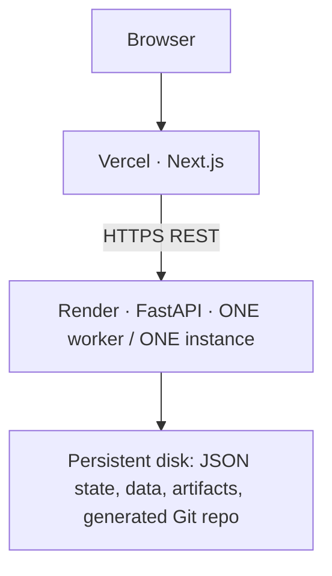

# Deployment: Vercel + Render

The application is live. Public frontend: **https://datasentinel-seven.vercel.app**. Technical API base: `https://datasentinel-api-gw7s.onrender.com`. Hosted health, CORS, golden-path resolution and restart persistence were verified. The settings below document the deployed architecture; this content update does not deploy anything.



Render is the chosen backend host. The Dockerfile installs Git explicitly and keeps runtime data outside the application source. The persistent disk preserves incidents across restarts. No database or distributed services are required.

Railway is also compatible: its persistent volumes cannot be used with replicas. Render is preferred here because the existing Blueprint declares the Docker build, single instance, disk mount, environment and health endpoint together. Both platforms still need one application worker. See [Railway volume constraints](https://docs.railway.com/volumes/reference) and [Render disk constraints](https://render.com/docs/disks).

## Render backend

The deployed configuration is published on `main`. Render uses the repository-root `render.yaml`, Docker runtime, **Frankfurt**, one `1c-2g` instance and a 1 GB persistent disk. Region is selected when the service is created. Automatic deployment remains off.

For a fresh installation:

1. Connect the GitHub repository through **New → Blueprint**, select `main`, and use root `render.yaml`.
2. Review the paid service and disk settings before creating them.
3. Set `DATASENTINEL_CORS_ORIGINS=["https://datasentinel-seven.vercel.app"]` for this frontend, or the exact origin of your own deployment.
4. Deploy manually and verify `/health`, then initialize from the frontend.

The Blueprint uses repository-root Docker context and `backend/Dockerfile`. Do not set a backend root directory: the image also copies selected root demo scripts. Screenshot/failure-fixture tooling is excluded. Render builds the Dockerfile automatically; leave its dashboard Build Command and Docker Command overrides unset. Equivalent exact backend build command, from the repository root:

```sh
docker build -f backend/Dockerfile -t datasentinel-api .
```

Inside the image, dependencies are installed with `pip install --no-cache-dir -r requirements.txt` from `/app/backend`; Git is installed with apt. The Dockerfile starts this exact command from `/app/backend`:

```sh
exec uvicorn app.main:app --host 0.0.0.0 --port "${PORT:-8000}" --workers 1
```

`PORT` is supplied by Render. The image defaults to 8000 locally. Automatic deployment is disabled to keep the presentation stable; use **Manual Deploy → Deploy latest commit** for release updates.

**Exactly one worker and one instance.** Never enable autoscaling or multiple Gunicorn/Uvicorn workers. `threading.RLock` and the service singleton protect only one process. A disk-backed service has downtime during deployment; schedule updates outside the live demo. Do not run reset/golden-path scripts in a second process while the API is serving that same runtime directory.

## Vercel frontend

1. Import the same GitHub repository into Vercel.
2. Framework preset: **Next.js**. Root Directory: **frontend**. Install Command: `npm ci`. Build Command: `npm run build` (already expands to `next build --webpack`). Leave Output Directory at the framework default. `frontend/vercel.json` records the framework and commands; Root Directory is a dashboard setting.
3. Select Node **24.x** in Vercel Project Settings, a supported LTS version meeting Next.js's >=20.9 requirement. Set the production branch to `main`. Release-content changes stay on `release-content` until reviewed and merged. See [Vercel Node versions](https://vercel.com/docs/functions/runtimes/node-js/node-js-versions).
4. Add `NEXT_PUBLIC_API_URL=https://datasentinel-api-gw7s.onrender.com` under **Settings → Environment Variables**, for **Production**. It is the API base URL, without `/api` and preferably without a trailing slash. It must use HTTPS.
5. Deploy, record the stable production frontend origin, then update Render's `DATASENTINEL_CORS_ORIGINS` and redeploy the backend.
6. If you also want Vercel previews, configure their API URL and individually allow the exact preview origins. A preview hostname is not automatically allowed by the production origin.
7. Redeploy Vercel after changing `NEXT_PUBLIC_API_URL`: it is embedded at build time. Record the verified frontend/backend URLs for the subsequent release stage.

No frontend secrets are needed. The existing direct REST client remains in place.

## Environment variables

| Variable | Location | Deployment value / purpose |
|---|---|---|
| `DATASENTINEL_HOME` | Render | `/var/lib/datasentinel`; data and artifacts under disk mount |
| `DATASENTINEL_WORKSPACE_DIR` | Render | `/var/lib/datasentinel/workspace`; generated `pipeline_repo` inside it |
| `DATASENTINEL_CORS_ORIGINS` | Render | JSON array of exact frontend origins |
| `WEB_CONCURRENCY` | Render | `1`; actual command also pins `--workers 1` |
| `PORT` | Render | Host supplied; do not hard-code the hosting port |
| `LLM_PROVIDER` | Render | `heuristic`; deterministic, offline, no key |
| `DATASENTINEL_DEFAULT_ROWS` | Render, optional | `110000` default |
| `DATASENTINEL_DEFAULT_SEED` | Render, optional | `42` default |
| `NEXT_PUBLIC_API_URL` | Vercel | Deployed HTTPS backend base URL |

Keep `LLM_PROVIDER=heuristic` for the initial public demo, and leave provider keys unset. `DATASENTINEL_WORKSPACE_DIR` is explicitly set in the Blueprint for clarity; it could be omitted because its default is `<DATASENTINEL_HOME>/workspace`. Optional threshold overrides use `DATASENTINEL_THRESHOLDS` as JSON; leave them at defaults for the first deployment. `DATASENTINEL_GIT_TIMEOUT_SECONDS` and `DATASENTINEL_TEST_TIMEOUT_SECONDS` default to 20 and 120 seconds.

All paths derive from configuration or packaged source; no developer macOS paths are required. The template repository stays under `backend/app/pipeline/template_repo`; reset recreates the monitored repository on the runtime disk.

The image currently runs as the default container user. The mounted directory must be writable by that user and support ordinary file creation, atomic rename and Git operations. Data lives under `/var/lib/datasentinel/data`, artifacts/state under `/var/lib/datasentinel/artifacts`, and monitored Git history under `/var/lib/datasentinel/workspace/pipeline_repo`. Disk contents are available only at runtime, so do not seed data in a build/pre-deploy command. After first startup, initialize using the reset API/UI. Only files under the disk mount are persistent.

## Optional LLM configuration

The initial deployment runs without any API key. Only if you explicitly choose a hosted provider later:

| Variable | Where to configure | Minimum access |
|---|---|---|
| `LLM_PROVIDER=anthropic` + `ANTHROPIC_API_KEY` | Render Environment secret settings | Model inference access for the selected model; no admin permission needed |
| `LLM_PROVIDER=openai` + `OPENAI_API_KEY` | Render Environment secret settings | Model inference access for the selected model; no account administration needed |
| `LLM_MODEL` | Render Environment | Optional accessible model identifier |
| `LLM_TIMEOUT_SECONDS` | Render Environment | Optional, defaults to 60 |

For local provider experiments these keys belong in your local shell or ignored root `.env`. Never put them in Vercel, `NEXT_PUBLIC_*`, source, screenshots or docs. Invalid or unreachable providers fall back to heuristic RCA with an engine note. Detection and validation never require provider access.

## Health, reset and CORS verification

Use these deployed URLs for technical checks:

```sh
BACKEND_URL=https://datasentinel-api-gw7s.onrender.com
FRONTEND_ORIGIN=https://datasentinel-seven.vercel.app
curl -fsS "$BACKEND_URL/health"
curl -i -X OPTIONS "$BACKEND_URL/api/demo/reset" \
  -H "Origin: $FRONTEND_ORIGIN" \
  -H 'Access-Control-Request-Method: POST' \
  -H 'Access-Control-Request-Headers: content-type'
```

Health must show `status: ok` and heuristic RCA. Preflight must return 200 and `access-control-allow-origin` equal to your frontend origin. `/health` is liveness, not an end-to-end readiness test.

In the deployed UI, click **Reset Demo → Run Healthy Pipeline**. Confirm API connected, SUCCESS / HEALTHY and 110,000 rows. Reset must rebuild the monitored Git repo, not merely clear the screen. Then **Inject Incident → Run Pipeline → Detect → Investigate → Generate Fix → Apply Fix → Validate**. Confirm SUCCESS / CRITICAL before the fix and RESOLVED / HEALTHY afterward. Verify a report and committed remediation are visible. Use only synthetic data: this is a shared, resettable hackathon demo without authentication, not a private production data service. CORS does not authorize API requests.

The ordinary deployed demo has no validation-failure injection endpoint. A real validation failure with an applied patch enables **Roll Back Fix**. Verify operator control, a rollback commit and a retryable incident if that condition occurs. Do not manufacture it in a public workspace.

After initialization, a service restart should preserve the baseline, incident state and repository HEAD. Verify that once after deployment, outside presentation time. Reset deliberately replaces demo data, artifacts and the monitored Git repository; restart does not.

## Local container check

```sh
docker build -f backend/Dockerfile -t datasentinel-api .
docker run --rm -p 8000:8000 -e PORT=8000 \
  -e 'DATASENTINEL_CORS_ORIGINS=["http://localhost:3000"]' \
  -v datasentinel-runtime:/var/lib/datasentinel datasentinel-api
```

Use a dedicated test volume. Reset replaces its demo state. A Docker daemon is needed for this optional local check. Render has built and run the deployed image successfully.

## Hosted Verification Record

- Health returned `status=ok` and `rca_engine=heuristic`.
- Exact-origin CORS preflight returned HTTP 200 with the deployed frontend origin.
- Reset recreated the real monitored repository and seeded data.
- The hosted filter-regression flow produced SUCCESS / CRITICAL at 43,760 rows and resolved after an approved repair restored 110,000 rows.
- All nine validation checks passed, including six monitored-repository tests.
- State fetched before and after the owner-performed Render restart was byte-identical, preserving run history, the resolved incident and repository state.
- The normal hosted repair passes validation; failed-validation/rollback was exercised with a disclosed isolated local fixture, not forced into the live service.

These checks establish this demo's observed behavior. Host memory usage has not been benchmarked. The engineering release passed 62 backend tests, frontend TypeScript checking and a production build; content-only work does not rerun that suite.

## Troubleshooting

| Symptom | Check / action |
|---|---|
| Frontend calls localhost | Set Vercel Production `NEXT_PUBLIC_API_URL`, then redeploy |
| Browser CORS error | JSON array, exact scheme/hostname/port, no trailing slash; restart backend after env change |
| API offline / mixed content | HTTPS API URL; inspect `/health` and Render logs |
| Reset fails to create Git repo | Image contains Git; disk mounted; both runtime paths are writable |
| State disappears after deploy | All runtime paths must stay under the persistent mount |
| Out of memory | Check host metrics during reset/profile/validation; increase memory, keep one worker |
| 409 response | Follow the workflow step named in the readable error, or reset the demo |
| LLM note shows fallback | Check provider/model/key in backend settings; heuristic demo remains functional |
| State collisions | Keep one worker and one instance; reserve presentation time so other visitors do not reset it |

Configuration references: [Render Blueprint reference](https://render.com/docs/blueprint-spec), [Render persistent disks](https://render.com/docs/disks), [Vercel build settings](https://vercel.com/docs/builds/configure-a-build), [Vercel environment variables](https://vercel.com/docs/environment-variables).
