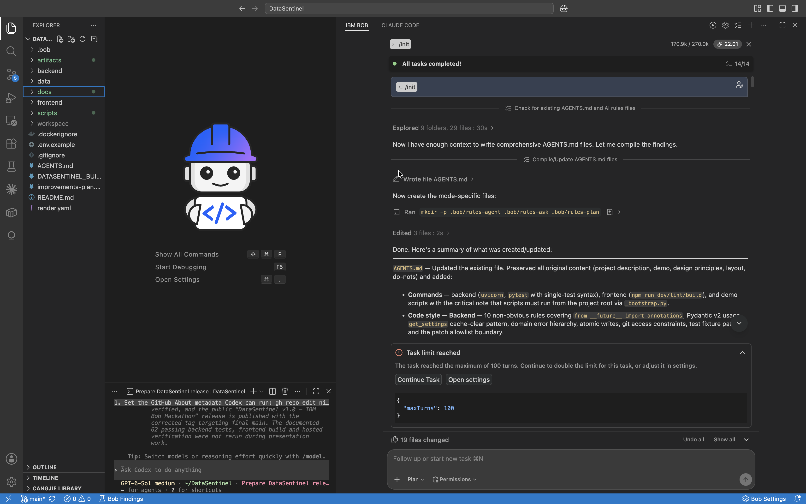
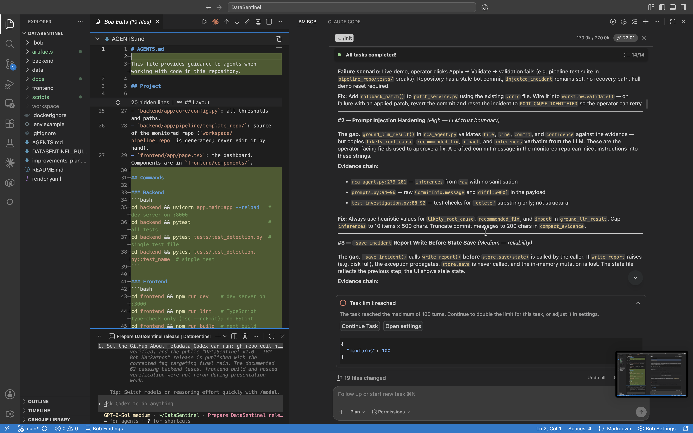
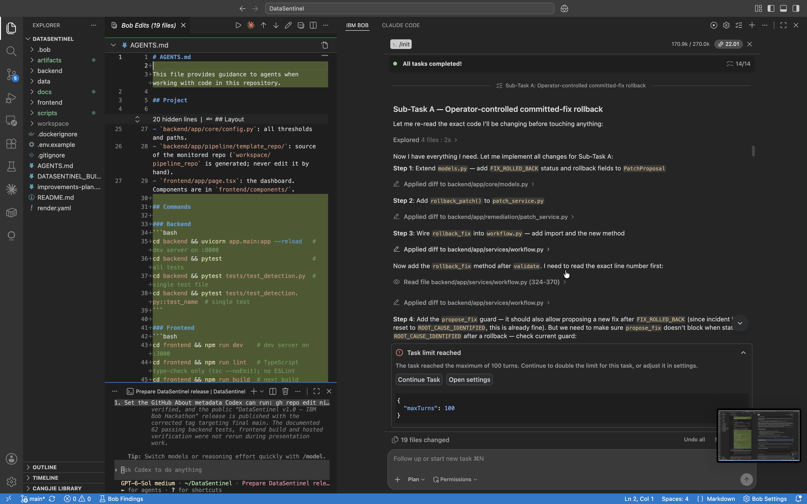
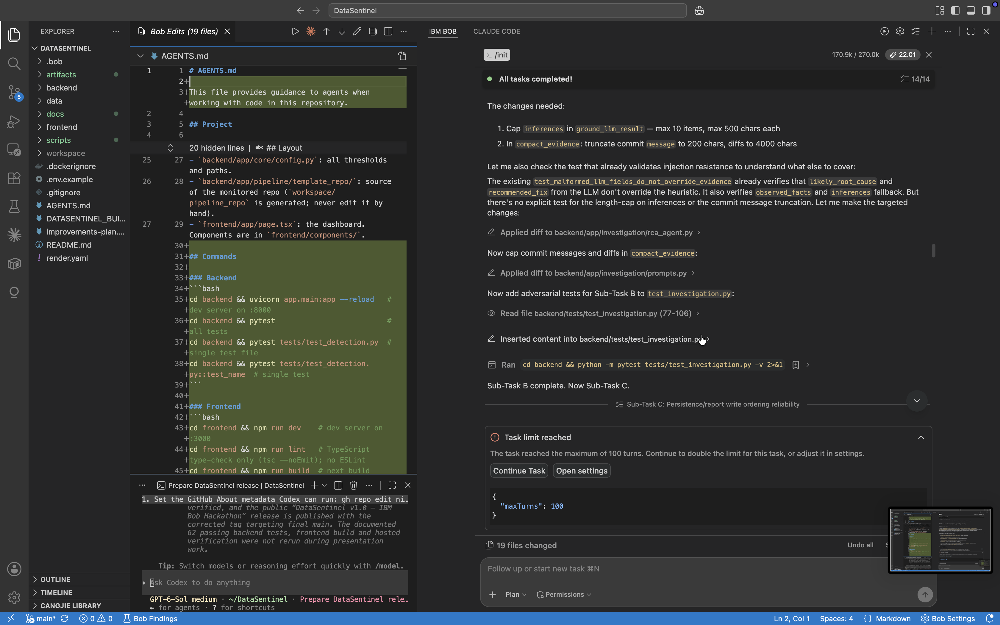
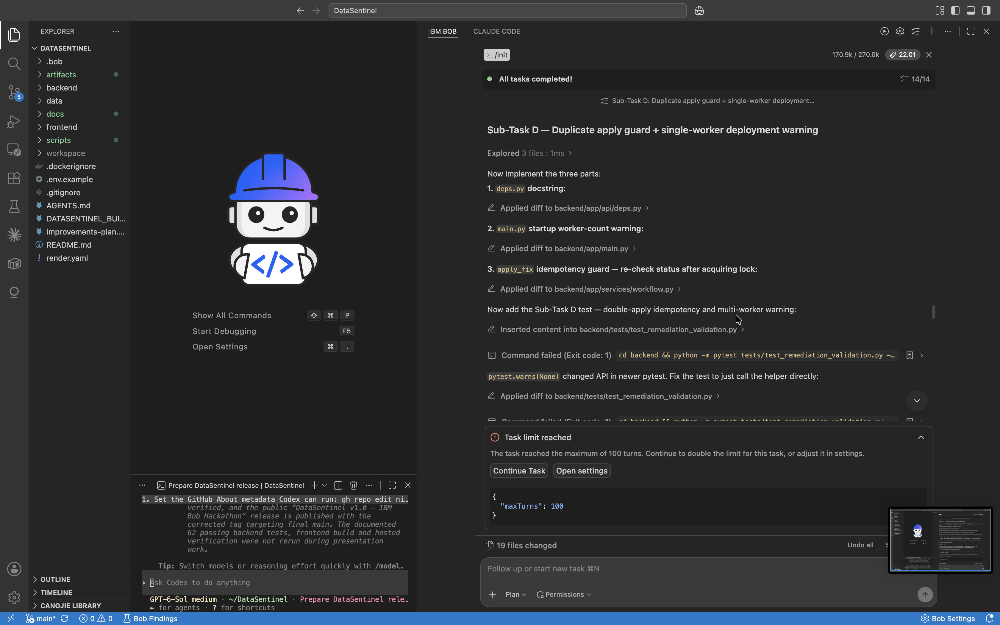
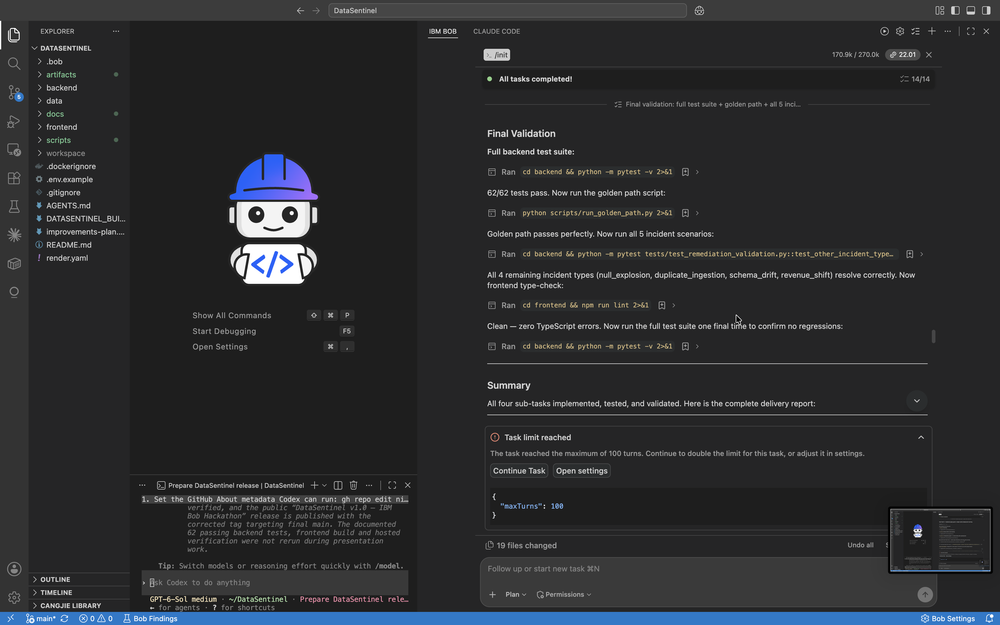
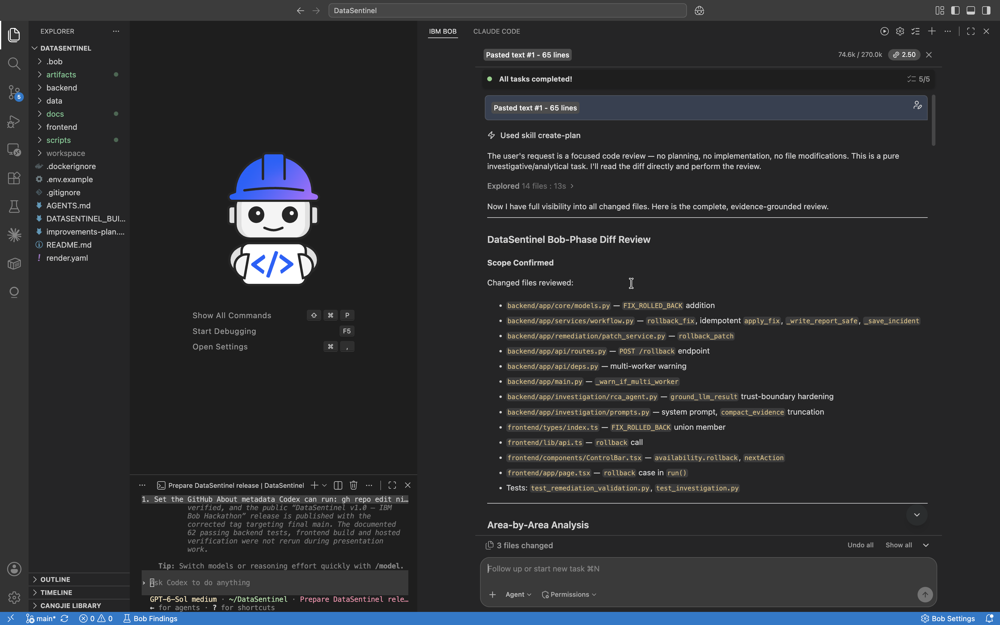
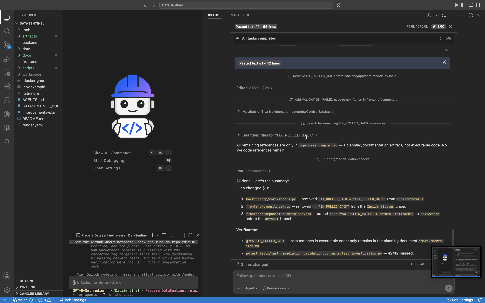

# IBM Bob Task Session Evidence

IBM Bob was used on the existing DataSentinel repository for repository-level reliability engineering, implementation hardening, testing, and independent review.

The initial working MVP already existed before the IBM Bob phase. Bob was used to inspect the repository, identify reliability gaps, implement targeted improvements, validate them, and independently review the Bob-phase diff.

These are eight selected, unedited screenshots from the manually captured Bob sessions. Validation results below are historical results reported in those sessions.

## 1. Repository Initialization

Bob `/init` inspected the repository and updated repository-specific context and agent rules, including `AGENTS.md` and mode-specific rules under `.bob/`.



## 2. Reliability Assessment

Bob performed a repository-level review and identified several reliability concerns, including the missing recovery path after a committed remediation fails validation.

Key findings included:

- missing committed-fix recovery path
- LLM / prompt-injection trust-boundary concerns
- state/report persistence ordering
- duplicate-apply and single-worker assumptions

The selected assessment screenshot shows recovery, trust-boundary, and persistence concerns. The duplicate-apply and worker concerns are also reflected in section 5. The full assessment is recorded in [improvements-plan.md](../../improvements-plan.md); Bob refined the trust-boundary finding during implementation, confirming that heuristic values were already authoritative.



## 3. Operator-Controlled Rollback

Bob implemented an explicit rollback path for failed remediation validation, including `rollback_patch` and `rollback_fix`, with API and frontend wiring represented in the implementation history and critic review.

The intended recovery flow is:

```text
FIX_APPLIED
→ VALIDATION_FAILED
→ OPERATOR ROLLBACK
→ ROOT_CAUSE_IDENTIFIED
→ RETRYABLE INCIDENT
```

`RETRYABLE INCIDENT` describes the recovery outcome, rather than a separate incident state. The intermediate implementation screenshot includes `FIX_ROLLED_BACK`, an unused incident state later removed in section 8.



## 4. RCA Trust-Boundary Hardening

Bob strengthened evidence grounding so deterministic evidence remains authoritative while optional LLM-generated explanation is bounded.

This included:

- preserving heuristic-authoritative root cause and recommended fix
- bounded inference text
- bounded commit messages and diffs
- adversarial grounding tests



## 5. Idempotency and Deployment Safety

Bob added duplicate-apply protection and documented the single-worker deployment assumption, with a startup warning for multiple workers. This warning does not provide distributed locking or prevent multiple workers from starting.

The screenshot shows implementation and an intermediate test compatibility failure; the final validation results are shown in section 6.



## 6. Final Validation

Bob reported the following results at the end of the implementation phase:

- 62 / 62 backend tests passing
- golden-path validation passing
- all incident scenarios resolving correctly
- frontend TypeScript/lint validation clean

The screenshot explicitly states “62/62 tests pass,” golden-path success, resolution of the four remaining incident types, and zero TypeScript errors.



## 7. Independent Critic Review

A separate Bob review task inspected the Bob-phase implementation and state-machine behavior. The screenshot shows the independent review task and its changed-file scope, including rollback, workflow, trust-boundary, frontend, and test changes.



## 8. Critic Fixes and Verification

The critic review identified smaller cleanup items, including removal of the unused `FIX_ROLLED_BACK` incident state and correction of the `VALIDATION_FAILED` frontend next-action hint.

The fixes were applied and targeted verification passed. The screenshot reports 42 / 42 targeted remediation and investigation tests passing.



## Related Implementation

The main Bob engineering work is represented in Git history by:

[`8176e22`](https://github.com/nitesh0007-edith/DataSentinel/commit/8176e22aac7675f28ea45d51d00927307a271e45) — `bob: add safe remediation rollback and strengthen RCA trust boundaries`

The Bob-assisted implementation includes changes across:

- `backend/app/core/models.py`
- `backend/app/remediation/patch_service.py`
- `backend/app/services/workflow.py`
- `backend/app/api/routes.py`
- `backend/app/api/deps.py`
- `backend/app/main.py`
- `backend/app/investigation/rca_agent.py`
- `backend/app/investigation/prompts.py`
- frontend rollback UI/API/types
- remediation, investigation, persistence and adversarial tests

IBM Bob did not build the entire DataSentinel project. Its role was repository-level reliability engineering and independent review of an existing working application.
